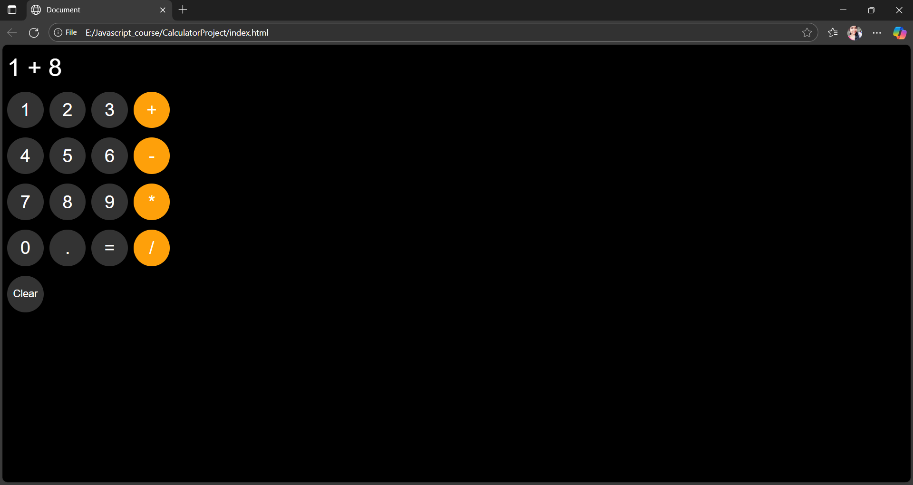

# 🧮 Calculator Project

This is a simple and responsive calculator web application built using **HTML**, **CSS**, and **JavaScript**.  
It performs basic arithmetic operations like addition, subtraction, multiplication, and division.

---

## 🚀 Features
- Perform basic math operations
- Clean and user-friendly interface
- Responsive design for all devices
- Clear button to reset the display

---

## 🛠️ Technologies Used
- **HTML5** – Structure of the calculator  
- **CSS3** – Styling and layout  
- **JavaScript** – Functionality and logic

---


---

## 💻 How to Use
1. Clone the repository:
   ```bash
   git clone https://github.com/your-username/calculator-project.git
